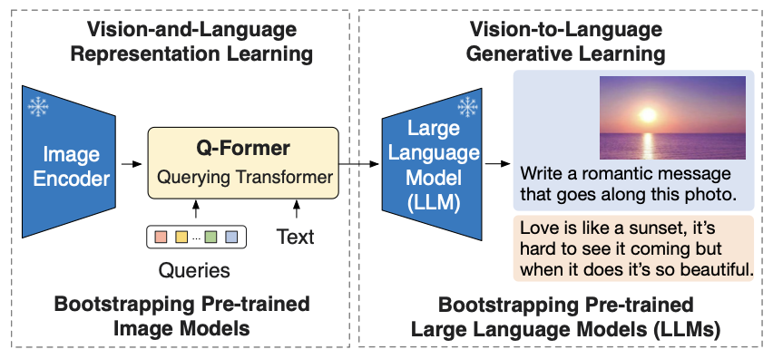
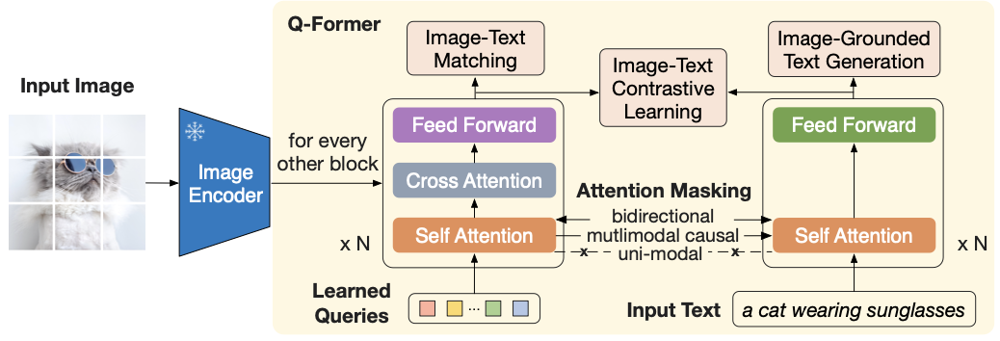
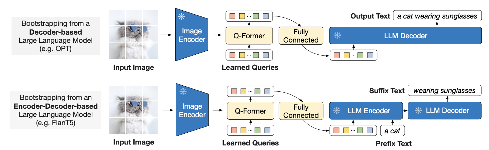

# BLIP-2

## 논문 리뷰

- **BLIP-2: Bootstrapping Language-Image Pre-training with Frozen Image Encoders and Large Language Models**

### Blip-2의 목표

- 효율적인 Vision Language Pre-training(VLP)를 만들자

### 기본 아이디어

- Bootstrap: 기본 자원을 활용하여 성능을 개선하는 방법
- **Frozen pre-trained vision model (image encoder )와  Frozen pre-trained lanugae model (llm)을 Bootstrap 한다**
- Bootstrapping Language-Image Pre-training → BLIP-2

### BLIP-2의 두단계

1. 시각-언어 **representation** 학습 수행
    - Image Encoder의 output과 Query vectors를 사용하여 텍스트와 관련된 시각 표현을 학습한다
2. 시각-언어 **generative** 학습 수행
    - Q-Former 출력을 LLM에 연결하여 Q-former가 생성한 시각적 표현이 LLM에서 해석될 수 있도록 학습한다

### Q-Former

- Transformer로 구성된다 → 2가지 Mode를 가짐
    1. Image Transformer: Frozen image encoder와 상호작용하여 시각적 attribute를 추출한다
    2. Text Transformer: Text encoder & decoder 역할을 수행한다 

### 1번째 단계: Representation Learning

- Frozen Image Encoder: 고정된 시각적 표현을 output으로 준다
- Learnable Query Vectors: Image Encoder의 output에서 유용한 정보를 선택적으로 추출

1. Image-Text Contrastive Learning (ITC)
    - 이미지 시각적 특징 추출한 것과 text 표현을 비교해서 positive/negative pair를 생성
        - positive pair: 가까이 배치 / negative pair: 멀리 배치
    - 이미지와 텍스트 페어를 벡터 공간에 정렬한다
2. Image Grounded Text Generation 
    - Q-former가 입력 이미지를 조건으로 텍스트를 생성하도록 학습한다
3. Image-Text Matching
    - 이미지와 텍스트 페어가 positive/negative 여부 예측 → Binary Classification
    - 세밀하게 positive/negative 페어를 분류한다

### 2번째 단계: Generation Learning

- Fully Connected output으로 나온 Query Vectors랑 LLM Encoder의 상호작용
    - 텍스트 생성에 필요한 정보를 전달
    - 시각정보를 자연어로 변환한다
- Q-Former의 Query Representation을 Soft prompt로 변환 → LLM 입력으로 제공
    - Soft promt: Q-Former가 추출한 시각적 표현 기반 LLM의 출력을 조건화
- Q-Former가 불필요한 시각적 정보를 제공해주기에 bottleneck 역할 → Catastrophic fortetting problem 줄어든다

## 모델 사용 예시 코드
[blip-2 code](https://www.kaggle.com/code/trispark/blip-2)